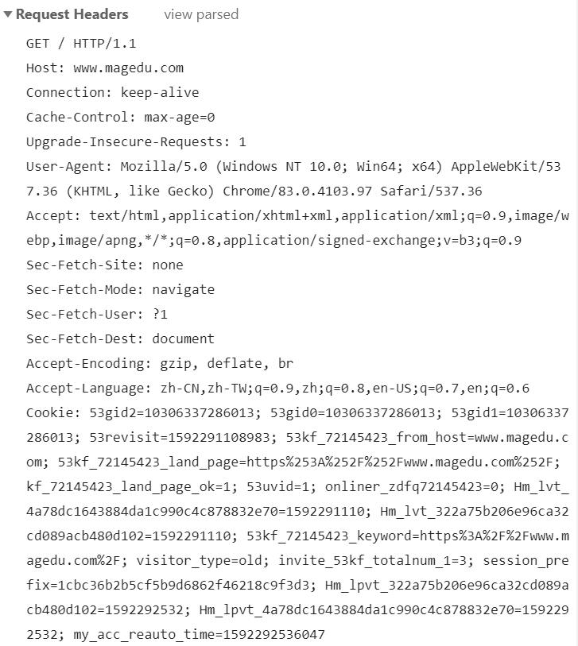

# Web开发

## CS编程

即客户端、服务器编程。

客户端、服务器端之间需要使用Socket，约定协议、版本（往往使用的协议是TCP或者UDP），指定地址和端口，就可以通信了。

客户端、服务器端传输数据，数据可以有一定的格式，双方必须先约定好。

## BS编程

即Browser、Server开发。

Browser浏览器，一种特殊的客户端，支持HTTP(S)协议，能够通过URL向服务端发起请求，等待服务端返回HTML等数据，并在浏览器内可视化展示的程序。

Server，支持HTTP(S)协议，能够接受众多客户端发起的HTTP协议请求，经过处理，将HTML等数据返回给浏览器。

本质上来说，BS是一种特殊的CS，即客户端必须是能够接受多客户端HTTP访问的服务器软件。

HTTP协议底层基于TCP协议实现。

- BS开发分为两端开发
  - 客户端开发，或称前端开发。HTML、CSS、JavaScript等
  - 服务器端开发，Python有WSGI、Django、Flask、Tornado等

# HTTP协议

## 安装httpd

`# yum install httpd`
使用httpd服务，观察http协议

## 协议

Http协议是无状态协议。
同一个客户端的两次请求之间没有任何关系，从服务器端角度来说，它不知道这两次请求来自同一个客户端。

## cookie

键值对信息。

浏览器发起每一次请求时，都会把cookie信息发给服务器端。

是一种客户端、服务器端传递数据的技术。

服务端可以通过判断这些信息，来确定这次请求是否和之前的请求有关联。

一般来说cookie信息是在服务器端生成，返回给客户端的。

## URL组成

URL可以说就是地址，uniform resource location 统一资源定位符，每一个链接指向一个资源供客户端访问。
`scheme://host[:port#]/path/.../[;url-params][?query-string][#anchor]`
例如，通过下面的URL访问网页
`http://www.magedu.com/pathon/index.html?id=5&name=python`
访问静态资源时，通过上面这个URL访问的是网站某路径下的index.html,而这个文件对应磁盘上的真实文件。就会从磁盘上读取这个文件，并把文件内容发回浏览器端。

scheme 模式、协议：
http、fpt、Https、file、mailto等。mysql等都是类似这样写的。

host:port

[www.magedu.com:80](http://www.magedu.com:80),80端口是默认端口可以不写。域名会使用DNS解析，域名会解析成IP才能使用。实际上会对解析后返回的IP的TCP的端口发起访问。

/path/to/resource
path, 指向资源的路径。

？key1=value1&key2=value2
query string,查询字符串，问号分割，后面key=value形式，且使用&符号分割。

## HTTP消息

消息分为Request、Response。
Request：浏览器向服务器发起的请求
Response：服务器对客户端请求的响应

请求和响应消息都是由请求行、Header消息报头、Body消息正文组成。

### 请求

请求消息行：请求方法Method请求路径 协议版本CRLF



请求方法Method
```
GET 请求获取URL对应的资源
POST 提交数据至服务器端
HEAD 和GET类似，不过不返回消息正文
```

常见传递信息的方式

1、GET方法使用Query String
`http://www.magedu.com/pathon/index.html?id=5&name=python`
通过查询字符串在URL中传递参数

2、POST方法提交数据

```
http://127.0.0.1:9999/xxx/yyy?id=5&name=magedu
使用表单提交数据，文本框input的name属性分别为age、weight、height

请求消息如下：
POST /xxx/yyy?id=5&name=magedu HTTP/1.1
HOST: 127.0.0.1:9999
content-length: 26
content-type: application/x-www-form-urlencoded

age=5&weight=80&height=170
```

3、URL中本身就包含着信息

`http://www.magedu.com/python/student/001`

### 响应

响应消息行：协议版本 状态码 消息描述CRLF


status code状态码

```
状态码在响应头第一行
    1xx 提示信息，表示请求已被成功接收，继续处理
    2xx 表示正常响应
        200 正常返回了网页内容
    3xx 重定向
        301 请求的网页已永久移动到新位置。 服务器返回此响应（对 GET 或 HEAD 请求的响应）时，会自动将请求者转到新位置
        302 服务器目前从不同位置的网页响应请求，但请求者应继续使用原有位置来进行以后的请求
        304 请求者应当对不同的位置使用单独的 GET 请求来检索响应时，服务器返回此代码
    4xx 客户端请求错误
        404 Not Found，网页找不到，客户端请求的资源有错
        400 请求语法错误
        401 请求要求身份验证
        403 服务器拒绝请求
    5xx 服务器端错误
        500 服务器内部错误
        502 上游服务器错误，例如nginx反向代理的时候
```
